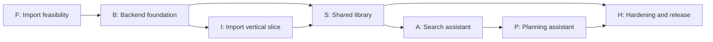

# ReelSpot actionable tasks

This backlog turns [PLAN.md](PLAN.md) and [ARCHITECTURE.md](ARCHITECTURE.md) into implementation work. Tasks are ordered by dependency. Complete the feasibility tasks before committing to paid extraction services or building advanced agent behaviour. Use the lightweight Git workflow in [DEVELOPMENT_WORKFLOW.md](DEVELOPMENT_WORKFLOW.md) while implementing it.

## How to use this backlog

Each task has:

- **Outcome:** the concrete thing that exists when the task is done.
- **Depends on:** work that must be finished first.
- **Acceptance criteria:** observable checks, not intentions.

Move a task to `Done` only when its acceptance criteria pass on a real device or against a documented test fixture. Keep provider assumptions and measured results in `docs/feasibility/` as they are discovered.

## Dependency map

## F — Import feasibility

| ID | Task | Depends on | Acceptance criteria |
| --- | --- | --- | --- |
| F-01 | Collect a representative evaluation set | — | 20–30 real shared links are recorded with platform, expected type, expected place/recipe, and manually verified evidence. Include missing captions, ambiguous branches, duplicate saves, and unavailable links. |
| F-02 | Create the URL normalizer and platform detector | F-01 | Canonical URLs, source platform, source ID where available, and a stable deduplication key are produced for test fixtures. Unsupported URLs are retained and clearly marked. |
| F-03 | Test the iOS Share extension payload | — | A physical iPhone can share representative links from each available source app into a test app. Record whether the extension receives a URL, text, or no useful payload. |
| F-04 | Implement YouTube metadata adapter | F-02 | Given a YouTube fixture, the adapter retrieves title/description and reports comments unavailable, disabled, or retrieved. It has timeout and quota error states. |
| F-05 | Implement TikTok metadata adapter | F-02 | Given a public TikTok fixture, the adapter records the documented oEmbed response or a clear unavailable state. No undocumented comment access is assumed. |
| F-06 | Test permitted Instagram access | F-02 | For the intended account type and credentials, document which caption/media/comment fields are available. Arbitrary unsupported access is represented as a failed capability, not a scraper assumption. |
| F-07 | Test permitted Facebook access | F-02 | Document whether the intended Facebook Reel links yield usable metadata through a supported path. Store a manual text/screenshot fallback if they do not. |
| F-08 | Build extraction evaluation harness | F-04, F-05 | A fixture can be run through extraction and produces structured JSON with fields, evidence references, confidence rationale, and errors. Results can be compared with labels. |
| F-09 | Measure feasibility | F-06, F-07, F-08 | Report per-platform access rate, extraction accuracy, wrong-place rate, review rate, latency, and cost. Choose initial provider scope from these results. |

**Milestone F exit:** one or more source adapters are supported by measured evidence, and unsupported sources still have a usable save/manual-review path.

## B — Backend and security foundation

| ID | Task | Depends on | Acceptance criteria |
| --- | --- | --- | --- |
| B-01 | Create the SwiftUI app shell and environments | — | Debug and release configurations exist; secrets are not committed; the app launches on a simulator and physical iPhone. |
| B-02 | Create Supabase project and migrations | — | Database migrations create shared spaces, memberships, saved items, evidence, places, recipes, tags, reactions, plans, plan stops, and processing jobs. |
| B-03 | Add authentication | B-01, B-02 | Two test users can sign in, sign out, restore a session, and handle expired sessions. |
| B-04 | Add shared-space invite and membership | B-03 | One user can invite the second user; both can see the same space; a non-member cannot read or write its records. |
| B-05 | Add row-level access policies | B-02, B-03 | Automated access checks prove that users cannot read, modify, or invoke assistant data for another shared space. |
| B-06 | Create backend API boundary | B-03, B-05 | API requests validate identity and shared-space membership before reads, writes, or job creation. |
| B-07 | Create durable job queue and worker lease | B-02, B-06 | A job is claimed, retried after a simulated failure, expires after a lease, and reaches a terminal success or review/error state. |
| B-08 | Add observability and cost records | B-07 | Each import records provider, model, latency, retry count, token/call usage where available, and an error category without storing secrets. |

**Milestone B exit:** two authenticated users can access only their shared space through a tested backend boundary.

## I — Import vertical slice

| ID | Task | Depends on | Acceptance criteria |
| --- | --- | --- | --- |
| I-01 | Implement local pending-save storage | B-01 | Sharing while offline preserves the URL and user note locally and displays a pending state. |
| I-02 | Upload a save idempotently | B-06, I-01 | Replaying the same request ID does not create duplicate saved items; the app reconciles local pending state with the server record. |
| I-03 | Enqueue import atomically with save | B-07, I-02 | A committed saved item always has one import job; a failed transaction leaves neither partial record nor orphan job. |
| I-04 | Implement evidence model and source adapters | F-09, I-03 | Raw accessible metadata, comments, user notes, and screenshots are stored with source, timestamp, and provenance. Unsupported content remains link-only. |
| I-05 | Implement typed extraction | F-08, I-04 | Extraction returns item type, candidate places, recipe fields, tags, and evidence references using schema validation. Missing fields remain unknown. |
| I-06 | Implement place candidate resolution | I-05 | Candidate place search records provider IDs, addresses, coordinates, and match evidence. Model-generated coordinates are rejected. |
| I-07 | Implement review and correction flow | I-06 | A user can select a candidate, add a suburb, paste text, or attach a screenshot. A correction survives reprocessing and records who made it. |
| I-08 | Build the first end-to-end demo | I-01–I-07 | One real shared reel becomes a correct evidence-backed place or recipe card visible on both phones, including an intentional needs-review case. |

**Milestone I exit:** the first real reel-to-card path works and failure never loses the original link.

## S — Shared library and map

| ID | Task | Depends on | Acceptance criteria |
| --- | --- | --- | --- |
| S-01 | Build Inbox | I-08 | Users can see recent saves, processing status, errors, and needs-review items, then open the relevant action. |
| S-02 | Build place and recipe detail cards | I-08 | Cards show source link, who saved it, evidence, uncertainty, tags, status, and correction controls. Recipe cards distinguish saved fields from estimates. |
| S-03 | Build MapKit map and list | I-06, S-02 | Confirmed places appear as pins and list results; tapping a pin opens its card; unresolved items are not shown as confirmed pins. |
| S-04 | Add geographic queries | B-02, S-03 | Map viewport and radius filters return correct places using PostGIS or the selected equivalent; results are paginated. |
| S-05 | Build Library filters and search | S-02 | Eat, Cook, and Visit views support type, activity subtype such as Walk, cuisine, dish/ingredient, status, and collection filters. |
| S-06 | Add reactions, status, and notes | B-02, S-02 | Each person can independently favourite, skip, mark visited/cooked, and add a note without overwriting the other person's data. |
| S-07 | Add deduplication and entity consolidation | I-06, S-06 | Repeated reels preserve their sources while confirmed references to the same place or recipe are consolidated. |
| S-08 | Add activity and walk details | S-02 | Activity cards support subtype, starting point, duration, distance, difficulty, and a clear distinction between a mapped start point and a route that has not been resolved. The Library exposes a Walks collection. |

**Milestone S exit:** both people can capture, browse, search, correct, and manage the shared collection without chat.

## T — Trail experience

| ID | Task | Depends on | Acceptance criteria |
| --- | --- | --- | --- |
| T-01 | Model trail-specific fields | S-08 | Activities can store trailhead, route type, route geometry reference, distance, elevation gain, duration, difficulty, surface, accessibility, dog policy, source, and last-verified time without requiring every field. |
| T-02 | Preserve optional external trail links | I-04, S-02 | An AllTrails or other trail link is stored as source evidence, displayed on the trail card, and opens through an explicit external-link action. It is not required for ReelSpot route data. No undocumented endpoint or scraped route data is required. |
| T-03 | Add GPX/GeoJSON user import | T-01 | A user can import a route file, review its name/start point/geometry, and provide source, rights/license status, attribution where applicable, visibility, and provenance before saving it as private shared-space user content. Invalid or oversized files fail clearly. The import does not bypass the no-copy/no-unlicensed-geometry rule or require public redistribution. |
| T-04 | Render a saved route on MapKit | T-03, T-05 | Permitted open or licensed independent geometry and user-provided geometry render as overlays with applicable attribution; geometry remains separate from the general activity record. When geometry is absent, the map falls back to a trailhead marker only. The trailhead has an explicit Apple Maps directions action when coordinates exist and a clear unavailable state when they do not. |
| T-05 | Build the independent trail data source | T-01 | Import a target-region OpenStreetMap/government dataset or selected licensed provider into ReelSpot's schema; record acquisition path, source/provider, license terms, attribution, dataset/version or retrieval timestamp, coverage, geometry and supported fields, rate limits, cost, and refresh/retirement handling. Retain provenance and freshness on imported trail records. |
| T-06 | Add trail filters | T-01, S-05 | Walks can be filtered by distance, duration, difficulty, route type, accessibility, dog policy, and visited status where data exists. Unknown values remain filterable as unknown. |
| T-07 | Add trail assistant tools | T-06, A-01 | `search_saved_trails`, `get_trail_details`, and `find_nearby_trails` return scoped records with source and freshness metadata. External discovery is visibly labelled. |
| T-08 | Add trail safety and freshness states | T-05 | Before any closure, weather, or condition field is shown, it has a selected provider or documented acquisition path, retrieval timestamp, and bounded refresh/retirement rule. The UI shows the provider and retrieval time; if no provider is selected or data is unavailable, the value remains unknown. Stale data is labelled and never presented as current. |

**Milestone T exit:** an independently sourced trail and a user-provided GPX route are visibly distinct, searchable, and handled with the correct attribution and freshness state. External trail links remain optional evidence.

## A — Search assistant

| ID | Task | Depends on | Acceptance criteria |
| --- | --- | --- | --- |
| A-01 | Define assistant tool schemas | S-05 | Typed schemas exist for `search_saved_items`, `get_item_evidence`, `find_nearby_places`, `get_place_details`, `estimate_travel_times`, `search_saved_trails`, `get_trail_details`, and `find_nearby_trails`; trail results retain source and freshness metadata, and invalid arguments fail safely. |
| A-02 | Enforce assistant authorization | B-05, A-01 | Every tool call is scoped to the active shared space; tests prove a prompt cannot access another space. |
| A-03 | Add embeddings and hybrid retrieval | S-05 | Exact filters, geographic filters, and semantic similarity can be combined. Retrieval returns record IDs and evidence, not unsupported prose. |
| A-04 | Build grounded answer UI | A-02, A-03 | Answers cite saved cards, distinguish unknowns/estimates, and provide an empty-result response without inventing a match. |
| A-05 | Evaluate real questions | A-04 | A held-out set of natural questions measures expected-record recall, citation correctness, no-match behaviour, latency, and cost. |

**Milestone A exit:** questions such as “the cosy noodle place she sent” retrieve the right saved records and show their evidence.

## P — Planning assistant

| ID | Task | Depends on | Acceptance criteria |
| --- | --- | --- | --- |
| P-01 | Define planning input and preference model | A-04 | Start point, date/time, available duration, travel mode, return-home requirement, craving/activity, budget, dietary constraints, and preferences have explicit editable fields. |
| P-02 | Implement candidate retrieval | A-03, P-01 | Planner retrieves saved places, recipes, and activities first, applying hard constraints before model ranking. |
| P-03 | Integrate place details and travel estimates | A-01, P-02 | Route duration, distance, and available place details are fetched with timestamps and unknown states. |
| P-04 | Implement deterministic itinerary calculation | P-03 | Code calculates travel, visit/meal duration, buffers, and return leg; infeasible plans are rejected or labelled as such. |
| P-05 | Generate ranked editable drafts | P-04 | Assistant explains why each option fits, links to saved records, and exposes estimates and uncertainties. |
| P-06 | Save and edit plans | P-05 | User intentionally saves a plan, reorders/removes stops, and sees recalculated totals. |
| P-07 | Evaluate planning scenarios | P-06 | Tests cover short durations, impossible schedules, missing hours, multiple branches, dietary constraints, and no saved match. |

**Milestone P exit:** the assistant creates an editable, evidence-linked plan whose arithmetic and constraints are correct.

## H — Hardening and release

| ID | Task | Depends on | Acceptance criteria |
| --- | --- | --- | --- |
| H-01 | Test source failure modes | I-08 | Tests cover deleted/private links, rate limits, disabled comments, malformed URLs, duplicate saves, and provider outages. |
| H-02 | Secure URL fetching and imported text | I-04 | Supported hosts and redirects are restricted; private-network destinations are blocked; imported text is treated as untrusted data and cannot alter tool policy. |
| H-03 | Add privacy controls | B-05, S-06 | Users can export and delete their data; retention for raw evidence and provider data is documented; logs exclude sensitive content where possible. |
| H-04 | Add budget and rate controls | B-08 | Per-space spending limits, provider call limits, and clear degraded states work in tests. |
| H-05 | Device and accessibility pass | S-07, A-04, P-06 | Test on supported iOS devices, poor connectivity, Dynamic Type, VoiceOver, dark mode, and permission denial paths. |
| H-06 | App Store and service readiness | H-01–H-05 | Privacy disclosures, source attribution, terms, account deletion, crash reporting, and production secrets are configured before TestFlight. |
| H-07 | TestFlight with the couple | H-06 | A real week of use records import coverage, review burden, wrong-place rate, assistant usefulness, latency, and cost; follow-up tasks are created from evidence. |

**Milestone H exit:** the app is safe to use with real data, operational costs are understood, and TestFlight feedback has been converted into the next backlog.

## Suggested first two weeks

Keep the first iteration narrow:

1. F-01: collect and label the real evaluation set.
2. F-02: normalize URLs and detect platforms.
3. F-03: test the Share extension on a physical iPhone.
4. B-01: create the SwiftUI app shell.
5. B-02: create the first database migration.
6. B-03: add Sign in with Apple or the chosen authentication flow.
7. I-01: save a pending link locally.
8. I-02: upload one link idempotently.
9. I-08: demonstrate one link becoming a shared placeholder card.

Do not start with graph visualization, video/audio analysis, automatic monitoring of messages, or a general-purpose multi-agent framework. Those depend on evidence from real imports and queries.

## Definition of done for every task

- The change is small enough to review and has a named acceptance check.
- Errors and unknown states are represented in the product rather than hidden.
- Shared-space authorization is tested for any data or assistant path.
- Provider/model calls have timeouts, bounded retries, and usage records.
- A real fixture, simulator test, or physical-device check demonstrates the result.
- Documentation records any provider limitation or assumption discovered.
