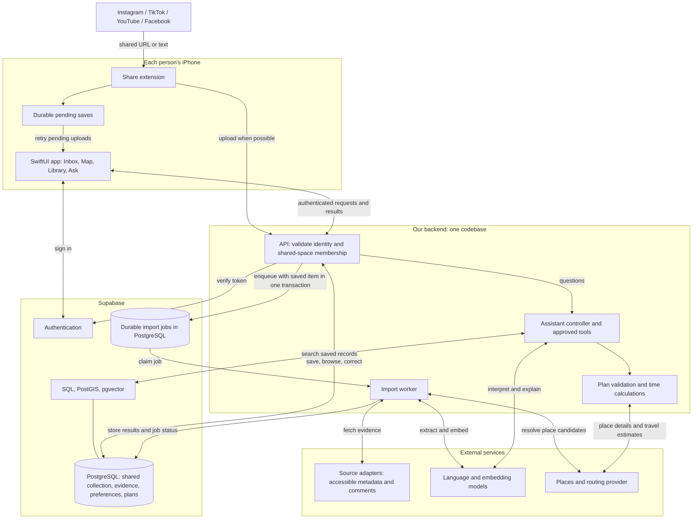
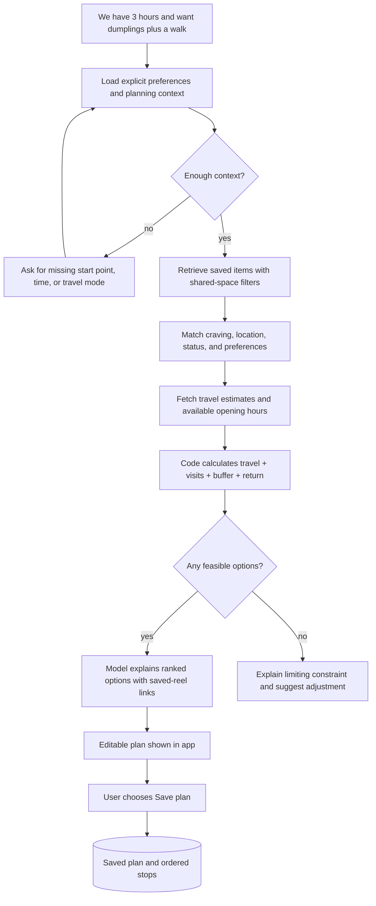
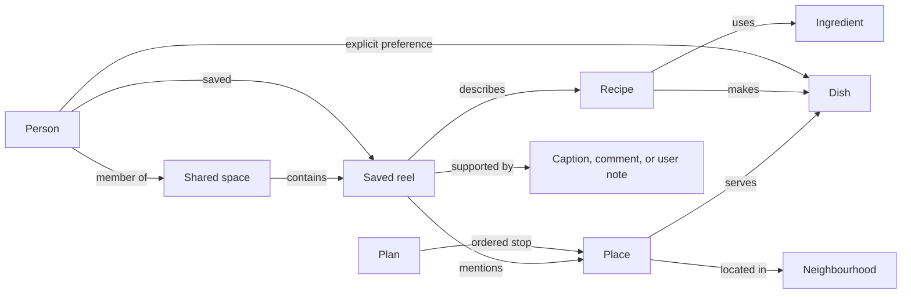

# ReelSpot architecture walkthrough

This describes the proposed solution, not running infrastructure. Read alongside [the product plan](PLAN.md). Import providers and the model provider remain to be validated. Each diagram describes the same system from a different angle.

## 1. The system and its boundaries



Boxes describe responsibilities, not a requirement for separate servers. Start with one backend codebase, an API process, a worker process, and one managed database. The assistant controller and planner are modules in that codebase. The queue can be a PostgreSQL jobs table; a separate queue service is unnecessary initially. The search box represents capabilities of the same database.

The phone handles interaction and display. The backend coordinates slow work and protects provider credentials. The database persists the collection for both people. External services provide evidence, language processing, place matching, or travel estimates.

The app draws maps with MapKit. The server-side places/routing provider supplies data for matching and planning; these are different responsibilities. Apple Maps is the starting candidate, with exact field coverage still to be checked.

The share extension is a small entry point launched from another app. It writes the pending save locally before attempting upload. If upload cannot complete, the main app can retry when it next runs; the design does not promise unlimited background execution on iOS. Locally queued and server-saved states must be distinguishable.

Authentication identifies a person. Authorization checks whether that person belongs to the requested shared space. Every data operation, including assistant tools and worker jobs, must respect that space. Database row policies provide an additional access boundary; privileged worker code must also explicitly scope operations.

## 2. Saving a reel: quick acknowledgement, slower enrichment

```mermaid
sequenceDiagram
    actor Person
    participant Phone as Share extension / app
    participant API as Backend API
    participant DB as Database and job queue
    participant Worker as Import worker
    participant Source as Content adapter
    participant Model as Extraction model
    participant Maps as Places provider

    Person->>Phone: Share reel URL
    Phone->>Phone: Persist pending save and request ID
    Phone->>API: Save URL, note, and request ID
    API->>API: Validate identity and membership
    API->>DB: Transaction: save item and enqueue job
    DB-->>API: Commit succeeds
    API-->>Phone: Saved, processing pending
    Phone-->>Person: Show saved acknowledgement

    Worker->>DB: Claim queued job
    Worker->>Source: Fetch accessible caption and metadata
    Source-->>Worker: Evidence or unavailable status
    opt Useful evidence is missing
        Worker->>Source: Try available relevant comments
        Source-->>Worker: Additional evidence or unavailable status
    end

    alt Enough evidence to extract
        Worker->>Model: Extract typed fields with evidence references
        Model-->>Worker: Place / recipe candidates and tags
        Worker->>Worker: Validate extracted fields
        opt One or more place candidates exist
            Worker->>Maps: Search by name and location clues
            Maps-->>Worker: Candidate places and coordinates
            Worker->>Worker: Evaluate matches against evidence
        end
        Worker->>DB: Store entities, evidence, and ready/review state
    else Content unavailable or insufficient
        Worker->>DB: Keep link and mark needs review
    end

    Phone->>API: Refresh collection and processing status
    API->>DB: Read records within shared space
    DB-->>API: Saved cards and statuses
    API-->>Phone: Updated collection
    opt Person corrects or supplements an item
        Person->>Phone: Select place, paste caption, or add screenshot
        Phone->>API: Submit correction or new evidence
        API->>DB: Save correction; enqueue enrichment if needed
    end
```

This is asynchronous processing: saving the item finishes before enriching it. A queue is a durable list of unfinished work. A worker takes a job, processes it, and records the outcome. If it crashes, a lease expires so the job can be retried.

Two small details prevent frustrating failures. Saving the item and creating its job happen in one database transaction, so an item cannot accidentally be saved without its job. A stable request ID makes retries idempotent: replaying the same save request does not create duplicates. URL deduplication is a separate rule that can consolidate two people saving the same reel while preserving both people's save activity.

The model extracts claims such as “restaurant name: X; suburb: Y.” The place resolver compares those claims against provider results. Ambiguous branches remain candidates, and recipes can complete without any place lookup. A review decision can apply to one entity within a multi-place reel rather than blocking every other result.

Poll for updates when the app is active initially. Realtime updates or push notifications can improve this later without changing how the collection is stored.

## 3. Asking for a plan: retrieval, tools, and calculation



An agent here is a model coordinated by application code that can execute a limited set of functions, called tools. Examples are `search_saved_items`, `get_item_evidence`, and `estimate_travel_times`. The backend checks tool arguments, executes the function, and returns its result to the model. The model does not receive unrestricted database access.

Retrieval supplies relevant saved records to the model at question time. This is often called retrieval-augmented generation, or RAG. It avoids putting the entire collection into every prompt and grounds answers in the couple's saved content.

The model interprets requests and explains results. Code checks hard constraints. For example, a hypothetical plan might require 20 minutes outbound + 60 minutes eating + 10 minutes between stops + 40 minutes walking + 25 minutes home + 15 minutes buffer = 170 minutes. A 180-minute budget leaves 10 minutes. These are example inputs, not real route estimates.

Unknown hours or uncertain visit times remain visible in the result. Missing critical information prevents a guaranteed-fit claim. A simple search question can return retrieved cards directly and skip route calculations entirely.

## 4. Memory: relationships and search in the same database



This is a conceptual graph, not the complete database schema. Each relationship can be represented by a foreign key or a linking table. For example, `item_places(item_id, place_id)` permits one reel to mention several places and one place to appear in several reels. Evidence records explain why a relationship or field was added. Shared-space scoping applies to every private record even where the diagram omits the link for readability.

| Mechanism | What it contributes | Example |
| --- | --- | --- |
| SQL and relational links | Exact facts and filters | Unvisited places saved by your girlfriend |
| PostGIS | Geographic filtering | Saved places within a map viewport or radius |
| pgvector embeddings | Similarity of meaning | “That cosy noodle place” despite different wording |
| Explicit preferences | Persistent personal context | One person dislikes mushrooms |
| Evidence references | Traceability and correction | The caption named this suburb |

An embedding is a numerical representation used to compare the meaning of text. It helps retrieve candidates; it does not verify that a venue exists or is open. Search should combine semantic matches with exact filters and geographic constraints. Route duration comes from routing tools, not straight-line distance.

The persistent memory is these records and relationships. Chat history can supply short-term conversational context, but a preference should become lasting memory through an explicit, editable record. The graph can later be visualized without changing database technology.

## 5. Implementation boundaries

Begin with one vertical slice: share a real reel → acknowledge the save → extract evidence → confirm a place → display the same card on both phones. This exercises identity, storage, jobs, source access, place matching, and shared browsing before adding the assistant.

The diagrams assume a backend API as the application's data entry point for a consistent authorization boundary. Direct Supabase client queries are an alternative, but mixing access patterns should be a deliberate decision. No additional microservices, separate graph server, or multi-agent runtime is required by this design.

Provider capabilities and source links are documented in [PLAN.md](PLAN.md). Caption/comment access, place-data coverage, operating costs, and device background behaviour remain implementation validation items; the diagrams do not imply those have already been proved.
