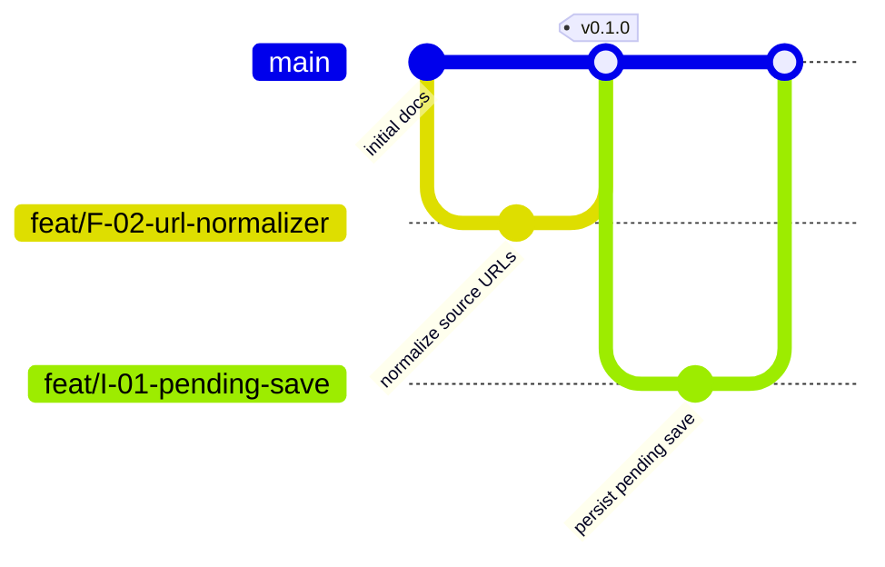

# Git branching strategy

ReelSpot should use a lightweight trunk-based workflow. The repository does not have Git initialized yet, so initialize it before the first implementation commit.

## Initial setup

The local repository and the GitHub repository are separate. You can create `main` and feature branches locally before a GitHub repository exists. A branch becomes visible on GitHub only after it is pushed to a configured remote.

Because this workspace is not a Git repository yet, run this once from the project directory:

```bash
git init -b main
git add PLAN.md ARCHITECTURE.md ACTIONABLE_TASKS.md DEVELOPMENT_WORKFLOW.md
git commit -m "docs: add ReelSpot product and architecture plan"
```

Then choose either route:

1. Create an empty **private** repository on GitHub, then connect and push it:

   ```bash
   git remote add origin git@github.com:<github-user>/reelspot.git
   git push -u origin main
   ```

   Leave README, licence, and `.gitignore` unchecked when creating the remote so it starts empty and does not create an unrelated first commit.

2. Create the private repository from the terminal with GitHub CLI, after `gh auth login`:

   ```bash
   gh repo create <github-user>/reelspot --private --source=. --remote=origin --push
   ```

The second route still creates the repository on GitHub; it simply avoids switching to the browser. Do not run it until the GitHub account and repository name are known.

Once `main` is pushed, create and publish a task branch as needed:

```bash
git switch -c feat/F-01-evaluation-set
git push -u origin feat/F-01-evaluation-set
```

You can also keep a branch local until it is ready for review. The remote branch and pull request are only necessary when you want GitHub's collaboration or review workflow.

## Branch layout



| Branch | Purpose | Lifetime |
| --- | --- | --- |
| `main` | The current integrated branch. It should build and be safe to demo. | Permanent |
| `feat/<task-id>-<short-name>` | One coherent backlog task or small slice, such as `feat/I-02-idempotent-upload`. | Hours to a few days |
| `spike/<task-id>-<short-name>` | Time-boxed feasibility work whose result may be code, measurements, or a decision, such as `spike/F-06-instagram-access`. | Short and disposable |
| `fix/<task-id>-<short-name>` | A correction to behaviour already on `main`. | Short |
| `chore/<short-name>` | Tooling, dependency, CI, or maintenance work. | Short |
| `docs/<short-name>` | Documentation-only changes. | Short |
| `release/<version>` | Optional stabilization branch for a TestFlight/App Store candidate. | Until released |

Do not create a permanent `develop` branch, platform branches, or one branch for every milestone. The milestones in `ACTIONABLE_TASKS.md` are delivery checkpoints, not long-lived Git branches.

## Rules

1. `main` is protected. Merge through a pull request, even when working alone; direct pushes are reserved for repository setup or emergency recovery.
2. Branch from the latest `main` and keep the branch focused on one task or one inseparable slice.
3. Put the backlog ID in the branch name, commit subject, and pull request title. For example: `feat(I-02-idempotent-upload)` and `feat(I-02): make save upload idempotent`.
4. A pull request should explain the user-visible or operational change, link the task, list validation, and call out migrations, provider changes, or new secrets.
5. Use squash merge for short-lived branches. This keeps `main` readable while the pull request retains the detailed discussion. Rebase your own unpublished branch if needed; do not rewrite a branch someone else is using.
6. Delete the branch after merging. If a spike is abandoned, record its findings in the feasibility notes before deleting it.
7. Keep incomplete UI behind a feature flag or leave it unmerged. Do not merge code that silently changes the import or assistant contract.

## Recommended lifecycle

```text
main
  → create feat/<task-id>-<name>
  → implement the smallest coherent change
  → run the task's acceptance check and relevant tests
  → open pull request
  → review diff and security/data implications
  → squash merge into main
  → delete branch
```

For feasibility work, use this variation:

```text
main
  → create spike/F-xx-<name>
  → time-box the experiment
  → record coverage, accuracy, cost, and limitations
  → merge reusable code and findings, or close without merging code
```

## Releases

Tag the exact commit sent to TestFlight or the App Store:

```text
v0.1.0  first shared-library test build
v0.2.0  searchable library and grounded assistant
v0.3.0  editable planning assistant
```

Use semantic versioning loosely: increment the minor version for a meaningful user capability and the patch version for a backwards-compatible fix. A `release/<version>` branch is only worthwhile when several fixes must be stabilized while new work continues on `main`; otherwise tag `main` directly.

## iOS and backend coordination

The app and backend should normally be changed in one pull request when they form one API contract. If they must be separate, merge the backend's backwards-compatible change first, deploy it, then merge the app change. Avoid a window where the released app requires an endpoint that production does not have.

Database migrations are append-only and backwards-compatible during rollout. Add new columns or tables before using them, deploy code, migrate existing data, and remove old fields only after no supported app version needs them. Never edit an already-applied production migration; create a new migration.

Xcode project files can conflict when two branches add files at the same time. Keep branches short, add files in small pull requests, and resolve `.pbxproj` conflicts in Xcode while checking that both targets still build.

## Minimum checks before merge

- The task's acceptance criteria pass.
- The app builds for the intended simulator or physical device.
- Relevant unit/integration tests pass; documentation-only changes still render correctly.
- Authorization and shared-space scope are checked for data or assistant changes.
- Provider/model calls have bounded timeouts and do not expose credentials.
- Database migrations apply cleanly to a fresh database and an upgrade path where relevant.
- The pull request states known limitations and follow-up task IDs.
