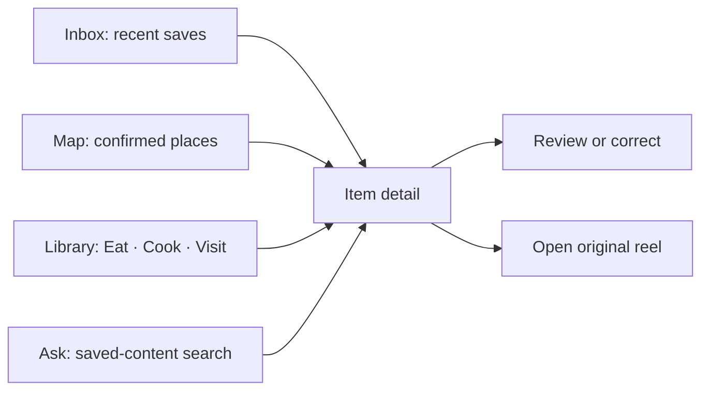
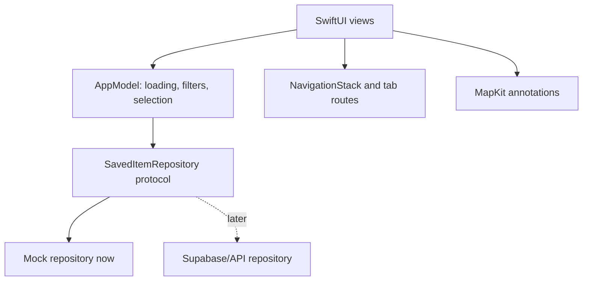

# ReelSpot front-end plan

The first front-end iteration is a native SwiftUI app backed by local mock data. The UI should be useful and testable before Supabase, import providers, or the assistant are connected.

## User-facing slice

The first shell has four tabs:

- Inbox shows processing, ready, and needs-review items.
- Map shows only confirmed place coordinates and opens the same detail screen.
- Library provides type, activity subtype (including Walks), status, and text filters without requiring chat.
- Ask presents example questions and a local mock response so the interaction can be designed before the assistant exists.

## Front-end boundaries

Views should render state and send user intent. `AppModel` owns screen-level state and filtering. The repository protocol keeps the UI independent of where data comes from. The mock repository is replaced by an authenticated API repository later; views should not need to know that change happened.

## State to design explicitly

Every screen should have loading, content, empty, and error states. Saved items also need `processing`, `ready`, `needs review`, and `failed` status. Unknown metadata should be displayed as unknown or estimated instead of omitted without explanation.

Use one stable `SavedItem` model for place, recipe, and activity cards. Activities have a subtype such as Walk, Hike, Beach, Museum, or Market. A walk can initially be represented by its starting point, distance, duration, and difficulty; route geometry and elevation can be added later. Keep evidence and source information visible on the detail screen. A map marker requires a coordinate from a resolved place or activity starting point; an unresolved candidate belongs in review and does not appear as a confirmed marker.

## Build order

1. Create the Xcode project and confirm a simulator and physical-device build.
2. Add the model, mock repository, and design tokens.
3. Add the tab shell and navigation destinations.
4. Build the Inbox and reusable saved-item rows/cards.
5. Build the detail and needs-review flows.
6. Add the MapKit view and confirmed-place list.
7. Add Library filters and search.
8. Add the Ask placeholder and example prompt interactions.
9. Add meaningful previews and UI tests for navigation, filtering, and review actions.
10. Add the Share extension after the core shell is stable.

## Front-end acceptance milestone

Using mock data, a user can open the app, see all four tabs, filter the library, open the same item from Inbox/Map/Library, inspect evidence and status, complete a needs-review action, and return to the collection. The app handles loading, empty, and error states and builds on a supported iPhone simulator.

## Design principles

- Make the saved reel the primary object; chat is an entry point, not the whole product.
- Show status and evidence close to the claim they support.
- Keep place and recipe cards visually related while making their different fields clear.
- Use system semantic colours and Dynamic Type first; add a custom visual identity after the information hierarchy works.
- Prefer small reusable components and previews over one large view file.
- Keep navigation state local to the feature and shared data state in `AppModel`.
