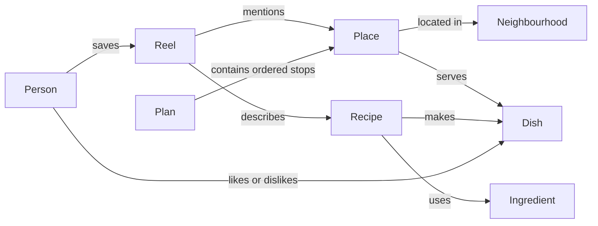

# ReelSpot build plan

Draft: 6 September 2026. This is a proposed product and implementation plan, not an implemented app. Platform capabilities below were checked against the linked documentation; no real reel imports have been tested yet.

See [ARCHITECTURE.md](ARCHITECTURE.md) for Mermaid diagrams and an explanation of component responsibilities, reel processing, assistant planning, and the memory model. See [ACTIONABLE_TASKS.md](ACTIONABLE_TASKS.md) for the ordered implementation backlog and acceptance criteria, and [DEVELOPMENT_WORKFLOW.md](DEVELOPMENT_WORKFLOW.md) for Git branching and release rules.

## Product

A private, shared collection for two people that turns reels into places to eat, recipes to cook, and things to do. Both people can browse the collection, search it, and ask an assistant to make practical plans from things they already saved.

Working assumptions: both people use iPhones; one shared space with separate identities; cloud processing is acceptable; links are deliberately shared into the app. Home city, dominant reel platform, hosting budget, and acceptable manual effort remain open. Sydney examples are illustrative, not a confirmed home location.

## Everyday experience

1. Either person uses Share → ReelSpot in a source app, or pastes a link into ReelSpot. Source apps may require opening the system share sheet through a further share option.
2. ReelSpot durably saves the link and optional note immediately. The share extension stays brief; a backend job performs enrichment. Offline saves remain queued for later upload, with pending state visible.
3. The job reads accessible caption/title metadata, extracts entities, categorizes the item, and searches for matching places.
4. A strong match produces a place card with a map pin and the evidence used. An ambiguous match goes to “Needs review,” where either person can choose a candidate, add a suburb, paste a caption, or attach a screenshot.
5. Both people see the saved item. They can mark it want to try, visited/cooked, favourite, or skipped; add notes; and keep individual reactions.
6. They browse the map or library, or ask: “Find the noodle place you saved,” “What can we cook in 30 minutes?” or “We have three hours and want dumplings plus a walk.”

The product does not assume access to the couple's private messages or automatic monitoring of their existing conversations. Sharing into ReelSpot is the proposed capture workflow.

## Import feasibility: prove this first

Receiving a URL and reading everything behind that URL are separate capabilities. Apple supports receiving shared content through a [Share extension](https://developer.apple.com/library/archive/documentation/General/Conceptual/ExtensibilityPG/Share.html); source-app payloads still need device testing.

| Source | Verified capability / unresolved issue | Proposed first implementation |
| --- | --- | --- |
| YouTube Shorts | The video API exposes titles and descriptions; the comments API can retrieve available comment threads. Disabled or inaccessible comments remain possible. | Resolve video ID, retrieve description, then inspect a bounded set of comments if needed. |
| TikTok | oEmbed documents description-like text in its `title` response. This does not establish general comment access. | Test oEmbed for public links; keep pasted text/screenshot fallback. |
| Instagram | Meta's API documentation focuses on professional accounts and their media/comments. It does not establish universal access to captions and comments for arbitrary shared reels. | Save links universally; validate permitted metadata retrieval on actual examples before promising automatic extraction. |
| Facebook | Arbitrary Reel caption/comment access was not verified in this research; direct Meta documentation retrieval was blocked. | Treat automatic extraction as an explicit feasibility gate; preserve link and manual enrichment. |

Sources: [YouTube videos](https://developers.google.com/youtube/v3/docs/videos/list), [YouTube comments](https://developers.google.com/youtube/v3/docs/commentThreads/list), [TikTok oEmbed](https://developers.tiktok.com/docs/en/embed-videos), and [Meta's official Instagram API collection](https://www.postman.com/meta/workspace/instagram/documentation/23987686-9386f468-7714-490f-9bfc-9442db5c8f00).

For Instagram/Facebook, compare an official supported path, a third-party extraction service if suitable, and user-provided text/screenshots. Assess actual coverage, credentials, permitted use, latency, retention, and cost before selecting a provider. A service's existence alone does not demonstrate suitability.

## Extraction and place matching

Pipeline: save → normalize URL and deduplicate → fetch accessible text → extract structured candidates → resolve entities → classify → index → mark ready or needs review.

- Start with captions/titles and user notes. If place evidence is insufficient, inspect available relevant comments. Author replies can be stronger evidence than unrelated guesses, but still require matching.
- OCR on user-provided screenshots can recover an address, caption, menu, or comment. Video/audio analysis is a later escalation for accessible or user-provided media, not a prerequisite for every import.
- Extract names, addresses, city/suburb, cuisine, dishes, ingredients, activities, price claims, and duration claims. Leave absent fields unknown.
- Search a places provider with the extracted name and location context. Compare candidate branch, address, and locality. Current user location is a search hint, not proof of the reel's location.
- Store evidence and its source per important field. Separate extracted claims, model suggestions, provider results, and user-confirmed values.
- Coordinates must come from a resolved place, geocoded address, or user pin. Do not use model-invented coordinates.
- Use evidence-based confidence rules, tuned on labelled examples. A model's self-reported confidence alone is insufficient for automatic pinning.
- Preserve all candidates when the branch is ambiguous. Corrections override later automatic reprocessing until deliberately changed.
- One reel can mention several places or recipes; several reels can refer to the same place. Preserve each source while consolidating confirmed entities.
- Unknown, deleted, private, or unsupported content remains a useful saved link with a clear state. It must not produce an invented place.

Recipes are first-class records. They need no location. Store ingredients, quantities, steps, servings, equipment, and active/total time only when supported. Label estimates and missing information. Recipe variations generated by the assistant must be distinguishable from the saved creator's recipe.

## Browsing and categories

Four main destinations:

- Inbox: recent saves, processing, and needs review.
- Map: confirmed places with cuisine/activity/distance/status filters and a linked list view.
- Library: Eat, Cook, Visit views, text search, flexible tags, and collections such as Date night or Weekend trip.
- Ask: conversational search, suggestions, and saved plans.

Use several independent facets rather than a single category tree: item type, cuisine, dish/ingredient, activity, location, budget, duration, occasion, and status. A reel may belong to more than one type. Dietary labels should preserve their evidence and unknown state.

Each detail card links back to its source reels, explains the match, supports corrections, and shows who saved it. The map and filters must remain useful without using chat.

## Trail experience and independent data

AllTrails is a useful product reference, but it is not a dependency. We can build the trail catalog, map, filters, route import, and planning experience inside ReelSpot without paying for AllTrails. Do not scrape hidden endpoints or copy AllTrails route geometry, ratings, photos, or reviews without permission or a licensed agreement.

ReelSpot should make these source modes explicit:

1. **Open/independent trail data (primary):** search and display routes from OpenStreetMap-derived data, government parks datasets, or a licensed provider. OpenStreetMap includes trails and permits use with attribution under its data license; its public tile service and usage limits still need to be respected. [OpenStreetMap license](https://www.openstreetmap.org/about/license)
2. **User-provided route:** let a user import a GPX/GeoJSON file or draw/record a route. Store it as user content with an explicit source and visibility. This gives ReelSpot a real route to draw without pretending it came from a commercial catalog.
3. **Saved external link (optional):** if a reel contains an AllTrails link, preserve it as evidence and offer “Open link.” It is only a reference link; ReelSpot does not need it to render, search, or plan from its own trail records.

The first trail version should combine modes 1 and 2. Start with a small target region and a curated/imported dataset rather than attempting worldwide coverage. Add more providers only if the open data has a measured gap (for example, missing elevation or closure information).

Trail records need more than a single pin: trailhead coordinate, route geometry when available, route type (loop, out-and-back, point-to-point), distance, elevation gain, estimated duration, difficulty, surface, accessibility, dog policy, last verified time, source, and safety/closure notes. Keep route geometry separate from the general activity record so a walk can exist without it. MapKit supports rendering path overlays such as polylines, so a resolved route can be drawn on the map. [MapKit overlays](https://developer.apple.com/documentation/mapkit/mapkit-overlays)

The assistant can then answer “Which saved walks are easy and under 5 km?” from ReelSpot records. For fresh trail discovery or safety data, use an explicitly labelled provider mode and show the provider and retrieval time. Do not present stale or unverified conditions as current. Navigation, offline maps, off-route alerts, and live safety features are a later product surface. Initially use MapKit for the map and route overlay, and Apple Maps for directions to the trailhead.

## Data and the graph idea

Use a domain knowledge graph represented initially by relational tables and links. Codebase memory is a useful analogy for connected, searchable knowledge; a particular codebase-memory tool has not been selected or assessed.

Example relationships:

Proposed core records: users, shared_spaces, memberships, saved_items, sources/evidence, places, recipes, recipe_ingredients, tags, item_places, item_recipes, item_tags, reactions, preferences, plans, plan_stops, and processing_jobs. Add explicit dishes/activities and their links when the corresponding query needs them.

Every private record and assistant query belongs to a shared space. Keep stable provider IDs for place identity where available, timestamps for external facts, and provenance for inferred fields. Provider-derived data storage/refresh must follow the selected provider's requirements.

Use SQL for exact filters and relationships, spatial queries for nearby places, and embeddings for fuzzy requests such as “the cosy pasta place she sent.” A dedicated graph database adds another service without an established need at this scale. Revisit it only when real queries justify it. A visual graph explorer can later render the same relationships if useful.

## Proposed architecture

- Native SwiftUI iOS app with MapKit and a small Share extension. This fits the iPhone-only scope and the share/map workflow. [MapKit for SwiftUI](https://developer.apple.com/documentation/mapkit/mapkit-for-swiftui)
- Supabase for authentication and PostgreSQL, with a shared-space membership model and row-level access policies. Its documentation includes a [SwiftUI integration](https://supabase.com/docs/guides/getting-started/tutorials/with-swift).
- PostGIS for map bounds/distance filtering and pgvector for semantic retrieval, both available within that database. [PostGIS](https://supabase.com/docs/guides/database/extensions/postgis), [pgvector](https://supabase.com/docs/guides/database/extensions/pgvector)
- One small backend service and durable job queue for import adapters, model calls, retries, and planning. Language is a routine implementation choice; Python is a reasonable default if no existing preference emerges.
- Start by evaluating Apple Maps for place search and travel estimates. Its [Server API](https://developer.apple.com/documentation/applemapsserverapi) supports these operations. Verify opening-hours availability separately; the plan must not assume every required field is available.
- One model integration supporting structured extraction and tool calls. Choose the provider/model using the reel evaluation set and measured cost; no multi-agent orchestration is needed initially.
- Local pending-save storage and a cached library for responsiveness. Keep privileged backend and model keys off the device.

Operational essentials: idempotent saves, bounded retries, timeout states, per-job cost/latency records, shared-space access checks, export/deletion, and a configurable spending limit. Treat imported captions/comments as untrusted data, not instructions to the assistant. Restrict URL fetching and redirects to supported public hosts and block private-network destinations.

## Assistant behaviour

Give the assistant a few typed tools: search_saved_items, get_item_evidence, find_nearby_places, get_place_details, estimate_travel_times, and draft_plan. Membership is enforced by the server; the model cannot choose another shared space.

For planning, gather start location, date/start time, available duration, travel mode, craving/activity, budget if relevant, and whether the time includes returning home. Reuse explicit preferences but allow each person to edit them.

Retrieve the couple's saved candidates first. Apply hard constraints, obtain travel estimates, and check opening hours when available. Calculate travel + visit/meal time + buffers + return leg when required in deterministic code. Let the model explain and rank feasible alternatives. Mark queue times and visit durations as estimates; mark hours unknown when unverified. If no plan fits, explain the limiting constraint and offer a smaller option.

Every suggestion links to saved items and explains why it fits. External discovery should be an explicit mode and clearly labelled. Saving a preference, modifying a collection, or accepting a plan should be an intentional user action. Browsing/searching is read-only by default.

For “What can we cook in 30 minutes?”, search recipes and verified/estimated total time, then ask about pantry ingredients only if needed. Do not claim missing quantities or preparation steps came from the reel.

## Delivery milestones

1. Import feasibility prototype. Use 20–30 representative reels from the couple's actual collection, including recipes, multiple venues, ambiguous branches, missing captions, and unavailable links. Label expected results manually. Report text-access rate per platform separately from extraction accuracy, wrong-place rate, manual correction burden, latency, and cost. This milestone determines whether the intended automatic experience is viable.
2. Useful shared app. Implement accounts/invite, share/paste capture, durable queue, chosen importer, manual enrichment, place confirmation, map/library filters, recipe cards, corrections, and visit/cook status. Done when both people can save independently, see shared results, and recover from an import failure without losing the link.
3. Search assistant. Add semantic search and typed retrieval tools. Evaluate against real questions with expected saved items, including paraphrases and no-match cases. Done when answers cite the right records and respect shared-space access.
4. Planning assistant. Add time/place constraints, travel estimates, ranked plans, editable stops, and plan saving. Done when itinerary totals are computed, uncertainty is visible, and infeasible requests produce honest alternatives.
5. Refinement from actual use. Consider OCR/video escalation, shopping lists, preference learning with confirmation, richer graph relationships, notifications, and additional providers based on observed gaps.

Keep a small held-out evaluation set. A provisional quality target is at least 95% correct venue/branch matches among automatically pinned evaluation items, while reporting coverage alongside accuracy. This is a target, not a measured claim. Uncertain items should go to review. Test duplicate imports, offline retries, multi-place reels, deleted sources, access isolation, and impossible schedules.

The first technical deliverable should be one real reel becoming a correct, evidence-backed card visible on both phones. Platform access, accounts, device signing/distribution, and measured provider costs must be settled during implementation. Do not buy services based on an untested extraction assumption.

Cost model: hosting baseline + imports × extraction-provider cost + model input/output usage + optional OCR/audio usage + place/routing calls + Apple distribution costs. Measure the first sample before estimating a monthly total. Avoid routine reprocessing of unchanged reels.
